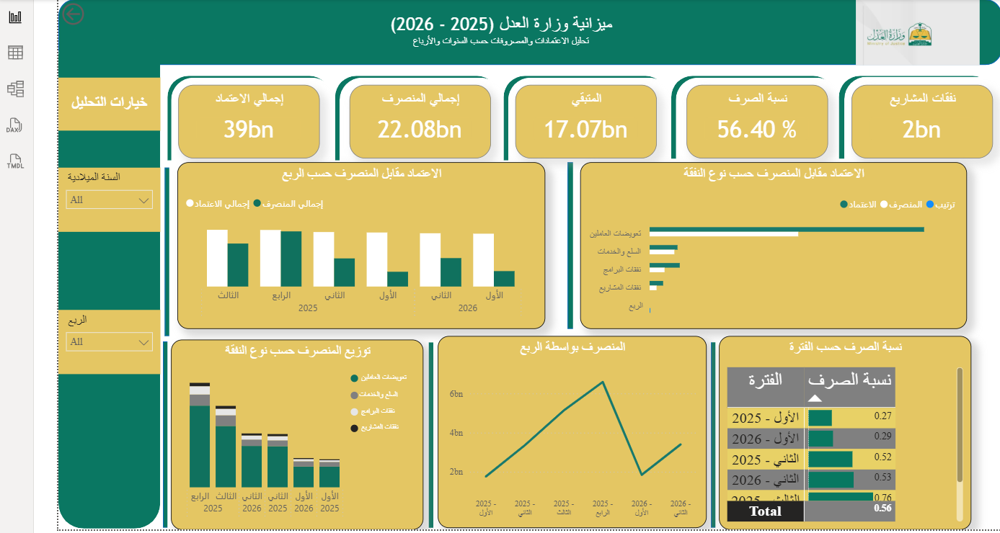

# Ministry of Justice Budget Analysis

## Project Overview

Power BI analysis of Ministry of Justice budget and expenditure data
covering quarterly data for 2025 and 2026.

The project analyzes budget allocations, actual expenditure,
spending rates, remaining budget, and expenditure distribution
across different budget categories.

## Data Source

The data was obtained from the Saudi Open Data Platform.

## Data Preparation

- Combined six quarterly Excel datasets using Power Query.
- Cleaned and standardized column names and data types.
- Added quarter and period fields.
- Transformed budget and expenditure data using Unpivot.
- Created calculated measures using DAX.

## Dashboard

## Key Analysis

- Total budget allocation
- Total expenditure
- Remaining budget
- Spending percentage
- Budget vs. expenditure by quarter
- Budget vs. expenditure by expense category
- Expenditure trends across periods
- Expenditure distribution by category

## Tools & Technologies

- Power BI
- Power Query
- DAX
- Excel
- Data Cleaning
- Data Transformation
- Data Visualization

## Skills Demonstrated

- Data cleaning and transformation
- Data modeling
- DAX measures
- Financial data analysis
- KPI development
- Dashboard design
- Trend analysis
- Data visualization
